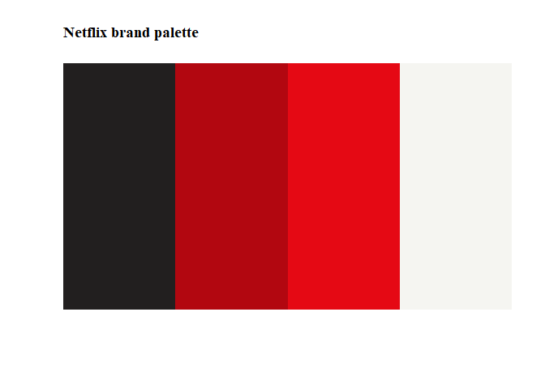
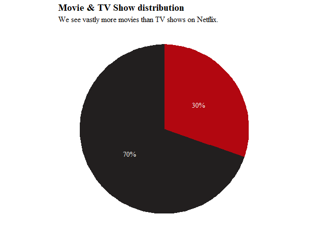
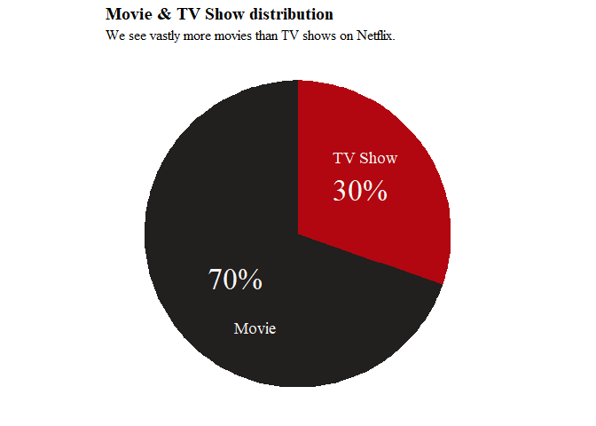
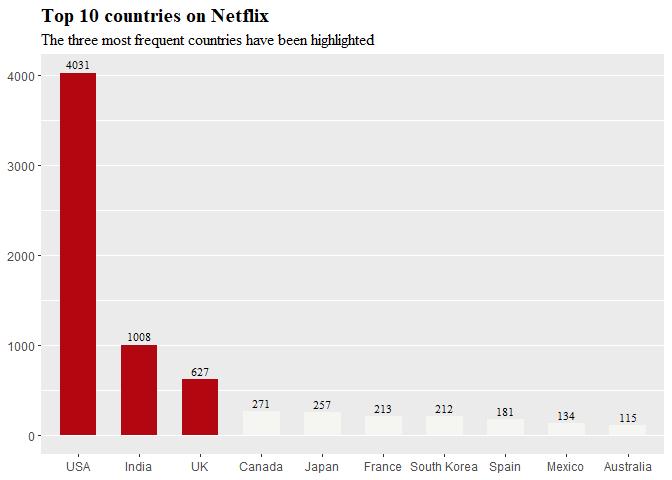
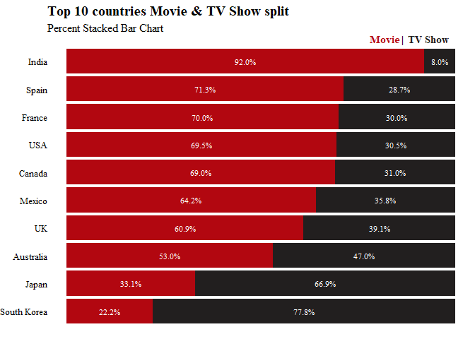
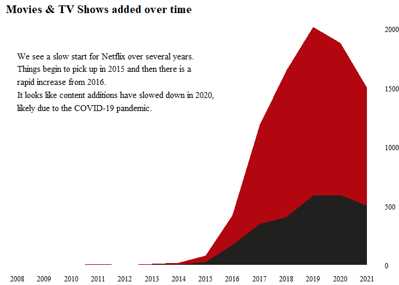

Netflix EDA
================
K.Wan
2022/4/14

## Intro

This is a practice on data visualisation inspired by [a notebook by
Josh](https://www.kaggle.com/code/joshuaswords/netflix-data-visualization)
creating amazing plots via Python. As for this analysis, I will use R.

For convenience, I will first load three useful packages: `tidyverse`
for data import and wrangling, `lubridate` for date functions, and
`ggplot2` for visualisation.

``` r
# install.packages("tidyverse")
# install.packages("lubridate")
library(tidyverse) # data import and tidy
```

    ## -- Attaching packages --------------------------------------- tidyverse 1.3.1 --

    ## v ggplot2 3.3.5     v purrr   0.3.4
    ## v tibble  3.1.6     v dplyr   1.0.8
    ## v tidyr   1.2.0     v stringr 1.4.0
    ## v readr   2.1.2     v forcats 0.5.1

    ## -- Conflicts ------------------------------------------ tidyverse_conflicts() --
    ## x dplyr::filter() masks stats::filter()
    ## x dplyr::lag()    masks stats::lag()

``` r
library(lubridate) # functions set for date, time
```

    ## 
    ## Attaching package: 'lubridate'

    ## The following objects are masked from 'package:base':
    ## 
    ##     date, intersect, setdiff, union

``` r
library(ggplot2) # helps visualise data
```

## Data import

It is worth noting that using `dplyr::read_csv()` instead of
`base::read.csv()` is necessary as this dataset contains a bunch of
strings with special characters that only appear normally with the
former function.

The second issue with the dataset including blank cells “” other than ”
“, which results in unidentified NA. Then assigning NA to”” needs to be
specified in the argument of reading files.

``` r
dt <- read_csv("netflix_titles.csv", na = "")
```

    ## Rows: 8807 Columns: 12
    ## -- Column specification --------------------------------------------------------
    ## Delimiter: ","
    ## chr (11): show_id, type, title, director, cast, country, date_added, rating,...
    ## dbl  (1): release_year
    ## 
    ## i Use `spec()` to retrieve the full column specification for this data.
    ## i Specify the column types or set `show_col_types = FALSE` to quiet this message.

## Data Cleaning

In this section, duplicated values, NAs, character and dates are to be
taken care of.

### Missing values

``` r
# check proportions of missing values for each variable

x <- apply(dt, 2, function (x) {mean(is.na(x))})
# note that x is a vector instead of a dataframe, use names(x) instead of colnames(x)

# print NAs proportions
for (i in 1:length(x)){
     if (x[i] > 0)
        print(noquote(str_c(names(x)[i],
                            " null rate: ", 
                            round(x[i]*100, digits =2), "%")))
   }
```

    ## [1] director null rate: 29.91%
    ## [1] cast null rate: 9.37%
    ## [1] country null rate: 9.44%
    ## [1] date_added null rate: 0.11%
    ## [1] rating null rate: 0.05%
    ## [1] duration null rate: 0.03%

``` r
# round() specifies the places after the decimal point

# noquote() for printing without quotation marks "

# count the number of missing values 
# x <- apply(dt, 2, function (x) {sum(is.na(x))})
```

Based on the result, missing values in most of columns account for
little and only the NAs from `director` mount to more than 10% of total
records.

But first, I want to have a closer look at NAs in `duration`.

``` r
dt %>% 
  filter(is.na(duration))
```

    ## # A tibble: 3 x 12
    ##   show_id type  title      director cast  country date_added release_year rating
    ##   <chr>   <chr> <chr>      <chr>    <chr> <chr>   <chr>             <dbl> <chr> 
    ## 1 s5542   Movie Louis C.K~ Louis C~ Loui~ United~ April 4, ~         2017 74 min
    ## 2 s5795   Movie Louis C.K~ Louis C~ Loui~ United~ September~         2010 84 min
    ## 3 s5814   Movie Louis C.K~ Louis C~ Loui~ United~ August 15~         2015 66 min
    ## # ... with 3 more variables: duration <chr>, listed_in <chr>, description <chr>

Apparently the missing `duration` values for three records were
mistakenly entered in the column of `rating`. That means we can manually
recover the missed values but adding three more NAs on corresponding
`rating` column at the same time.

Following code chunk is for replacing missed `duration` records.

``` r
magic <- dt[is.na(dt$duration), "rating"]
dt[is.na(dt$duration), "rating"] <- NA
dt[is.na(dt$duration), "duration"] <- magic 
```

For the rest variables, the missing values are not easy to retrieve but
the good news is either dropping a small number of rows or replacing
some with mode can be practically acceptable solutions:

-   Use mode in `country` to replace NA  
-   NAs in `cast` and `director` will be replaced with `No data`
-   Drop rows containing NAs in `rating` & `date_added`

``` r
# notice inconsistent text format in country names
dt %>% 
  count(country)
```

    ## # A tibble: 749 x 2
    ##    country                                                 n
    ##    <chr>                                               <int>
    ##  1 , France, Algeria                                       1
    ##  2 , South Korea                                           1
    ##  3 Argentina                                              56
    ##  4 Argentina, Brazil, France, Poland, Germany, Denmark     1
    ##  5 Argentina, Chile                                        2
    ##  6 Argentina, Chile, Peru                                  1
    ##  7 Argentina, France                                       1
    ##  8 Argentina, France, United States, Germany, Qatar        1
    ##  9 Argentina, Italy                                        1
    ## 10 Argentina, Spain                                        8
    ## # ... with 739 more rows

``` r
# find the mode of country 
## create an empty list
list1 <- list()
for (i in 1:nrow(dt)){
  new_value <- dt[i, "country"] %>% 
    str_split(",") # using comma to extract country
  list1 <- append(list1, new_value)
}

head(list1)
```

    ## [[1]]
    ## [1] "United States"
    ## 
    ## [[2]]
    ## [1] "South Africa"
    ## 
    ## [[3]]
    ## [1] NA
    ## 
    ## [[4]]
    ## [1] NA
    ## 
    ## [[5]]
    ## [1] "India"
    ## 
    ## [[6]]
    ## [1] NA

``` r
list1 <- lapply(list1, str_trim) # str_trim(" United Kingdom ")   == "United Kingdom"
list1 <- unlist(list1) # convert a list to a vector

country_level <- unique(na.omit(list1))
lc <- factor(list1, levels = country_level)
# count() cannot be used on characters directly, needs factoring

# return the country name that appeared most 
bb <- summary(na.omit(lc))
(mode_country <- names(bb[bb == max(bb)]))
```

    ## [1] "United States"

``` r
dtf <- dt %>% 
  replace_na(list(country = mode_country, 
                  # replace na in country with the mode
                  cast = "No data",
                  director = "No data"))
# the NAs in cast and director will be replaced with No data
```

The mode is `United States`.

``` r
dtf <- dtf %>% drop_na(rating, date_added)
dim(dtf)  ## (8790, 12)
```

    ## [1] 8790   12

xx records were removed.

### Duplicates

Delete replicated values using `dplyr::distinct()`.

``` r
dtf <- dtf %>% 
  distinct()
dim(dtf)  ## no duplicates, still 8790 rows.
```

    ## [1] 8790   12

No records removed.

### Dates

Formatting Dates/Times is another essential step. Observe the original
format of date variables and employ the matched function to transform
variables into universal forms.

``` r
dtf1 <- dtf %>% 
  mutate(date_added = mdy(date_added))

dtf1 <- dtf1 %>% 
  mutate(year_added = year(date_added), 
         month_added = month(date_added),
         month_name_added = month(date_added, label = TRUE), 
         day_added = mday(date_added))
```

## Visualise

Replicate an idea from Josh’s about using colours from Netflix’s icon to
make viz more interesting/engaging.

``` r
# showing the colour palette of Netflix symbol
colnet <- c("#221f1f", '#b20710', '#e50914','#f5f5f1')
image(1:length(colnet), 1, as.matrix(1:length(colnet)),
        col= colnet,
      xlab="", ylab = "", 
      xaxt = "n", yaxt = "n", bty = "n")
title(main = "Netflix brand palette", adj = 0, family = "serif")
```

<!-- -->

### Movies versus TV shows

``` r
# tally table
(fig1 <- dtf1 %>% 
  count(type) %>% 
  mutate(freq = n/sum(n)) %>% 
  mutate(labels1 = str_c(round(freq*100, 0), "%")))
```

    ## # A tibble: 2 x 4
    ##   type        n  freq labels1
    ##   <chr>   <int> <dbl> <chr>  
    ## 1 Movie    6126 0.697 70%    
    ## 2 TV Show  2664 0.303 30%

``` r
# pie chart for categories
ggplot(fig1, aes(x = "", y = freq, fill = type)) +
  geom_col() + 
  coord_polar(theta = "y") + 
  scale_fill_manual(values = c("#221f1f", '#b20710')) + 
  theme_void() +
  ggtitle(label = "Movie & TV Show distribution", 
          subtitle = "We see vastly more movies than TV shows on Netflix.")+
  theme(legend.position = "none", 
        plot.title = element_text(size = 15, family = 'serif', face = 'bold' ), 
        plot.subtitle = element_text(size =12 , family = 'serif' )) + 
  geom_text(aes(label = labels1), 
            color = "#f5f5f1", 
            position = position_stack(vjust = 0.5), 
            size = 4, family = "serif")            
```

<!-- -->

``` r
ggplot(fig1, aes(x = "", y = freq, fill = type)) +
  geom_col() +
  geom_text(aes(label = labels1),
            color = "#f5f5f1", 
            position = position_stack(vjust = 0.5),
            size = 9, family = "serif") +
  geom_text(aes(label = type, x = 1.15),
            color = "#f5f5f1", 
            position = position_stack(vjust = .38),
            size = 5, family = "serif") +
  coord_polar(theta = "y")+
  scale_fill_manual(values = c("#221f1f", '#b20710'))+
  theme_void() +
  ggtitle(label = "Movie & TV Show distribution", 
          subtitle = "We see vastly more movies than TV shows on Netflix.")+
  theme(legend.position = "none", 
        plot.title = element_text(size = 15, family = 'serif', face = 'bold' ),
        plot.subtitle = element_text(size =12 , family = 'serif' ))
```

<!-- -->

### Popularity across countries

``` r
# explore by country ------------------------------------------------------
# return the first country name on column country
fig2 <- dtf1 %>% 
  select(type, country) %>% 
  mutate(country = str_trim(country)) %>% 
  mutate(country = str_replace(country, "^, ", "")) %>%
 # mutate(country1 = sub(",.*$", "", country)) or
  mutate(country1 = sub(",.*", "", country)) %>% 
  mutate(across(country1, str_replace, 
                "United States", "USA")) %>% 
  mutate(across(country1, str_replace, 
                "United Kingdom", "UK"))

n_distinct(fig2$country1)
```

    ## [1] 85

``` r
fig2dt <- fig2 %>% 
  count(country1) %>% 
  arrange(desc(n)) %>% 
  head(10) 

# factor levels in decreasing order
fig2dt$country1 <- factor(fig2dt$country1, 
                        levels = 
                        fig2dt$country1[order(fig2dt$n, 
                                              decreasing = TRUE)])

ggplot(data = fig2dt, aes(x = country1, y = n)) +
  geom_bar(mapping = aes( fill = country1), 
           stat = "identity", width = 0.6) +
  geom_text(aes(label = n), vjust = -0.5, 
            size = 3, family = 'serif') +
  scale_fill_manual(values=c(rep('#b20710', 3),
                             rep('#f5f5f1', 7)))+
  ggtitle(label = "Top 10 countries on Netflix ", 
          subtitle = "The three most frequent countries have been highlighted") +
  theme(legend.position = "none", 
        panel.grid.major.x = element_blank(),
        panel.grid.minor.x = element_blank(), 
        plot.title = element_text(size = 15, 
                                  family = 'serif', face = 'bold' ),
        plot.subtitle = element_text(size =12 , 
                                     family = 'serif' )) +
  ylab(NULL) + xlab(NULL) 
```

<!-- -->

``` r
# + scale_x_discrete(breaks = fig2dt$country1, labels = c("USA", "India", "UK", as.character(fig2dt$country1[4:10])))
```

``` r
# fig2_2with stacked bar chart ---------------------------------------------
## add percent label
percentData <- fig2 %>% 
    filter(country1 %in% fig2dt$country1) %>% 
    group_by(country1) %>% 
    count(type) %>% 
    mutate(ratio=scales::percent(n/sum(n), accuracy = 0.1))

  factor_country <- percentData %>% 
    filter(type == "Movie") %>% 
    arrange(desc(ratio)) %>% 
# use pull()  other than select() to return a vector format
    pull(country1)

  
fig2dt2 <-  fig2 %>% 
      filter(country1 %in% fig2dt$country1) %>% 
      group_by(country1) %>% 
      count(type)
  
ggplot(data = fig2dt2,
       aes(x = fct_rev(factor(country1, levels = factor_country)), # to reverse the order of factor, fct_rev
           y = n,
           fill = factor(type, levels = c("TV Show", "Movie")))) +
  geom_bar(position = "fill", stat = "identity") + 
  scale_fill_manual(values=c('#221f1f','#b20710'), 
                    labels = c("TV Show", "Movie")) +
  geom_text(data=percentData, aes(y=n,label=ratio),
            position=position_fill(vjust=0.5), size = 3, 
            family = 'serif', color = 'white') +
  theme_void() +
  expand_limits(x= c(0, 11)) + # expand categorical axis x by 1, 10 +1
  ggtitle(label = "Top 10 countries Movie & TV Show split", 
          subtitle = "Percent Stacked Bar Chart") +
  annotate("text", x = 10.8, y = 0.82, label = "Movie", size = 4,
           family = 'serif', fontface="bold", colour="#b20710")+
  annotate("text", x = 10.8, y = 0.865, label = "|", size = 4,
           family = 'serif', fontface="bold", colour="black")+ 
  annotate("text", x = 10.8, y = 0.93, label = "TV Show", size = 4,
           family = 'serif', fontface="bold", colour="#221f1f")+  
  theme(legend.position = "none", 
        axis.text.y= element_text(family = 'serif', 
                             size = 10, hjust = 1,colour = 'black'),
        plot.title = element_text(size = 15, family = 'serif', face = 'bold' ),
        plot.subtitle = element_text(size =12 , family = 'serif', vjust = 1 )) + 
  coord_flip()  
```

<!-- -->

### Growth over time

``` r
fig3dt <- dtf1 %>% 
  count(year_added, type) %>% 
  rename(Year = year_added, added = n)

fig3dt %>% 
  ggplot(aes(x = Year, y = added, 
                          fill = type)) +
  scale_x_continuous(breaks = seq(min(fig3dt$Year), 
                                  max(fig3dt$Year), 1)) +
  scale_y_continuous(breaks = seq(0, 2000, 400)) +
  scale_fill_manual(values=c('#b20710', '#221f1f')) +
                    # labels = c("Movie", "TV Show")) +
  geom_area() +
  ggtitle(label = "  Movies & TV Shows added over time") +
  annotate("text", x = 2008, y = 1500 , label = "We see a slow start for Netflix over several years. 
Things begin to pick up in 2015 and then there is a 
rapid increase from 2016.
It looks like content additions have slowed down in 2020, 
likely due to the COVID-19 pandemic.
", family = 'serif', size = 4, colour = "black", hjust=0) +
  theme_void() +
  theme(legend.position = "none", 
        axis.text.y= element_text(family = 'serif', 
                                  size = 10, hjust = 0,colour = 'black'),
        axis.text.x= element_text(family = 'serif', 
                                  size = 10, colour = 'black', vjust = 2),
        plot.title = element_text(size = 15, family = 'serif', face = 'bold' ),
        ) +
  scale_y_continuous(position = "right") +
  ylab(NULL) 
```

<!-- -->

### TBC

-   What to consider next: how to shorten the distance between the plot
    area and the y-axis ticks or  
-   how to add a vertical line exactly on the edge of the graph.
